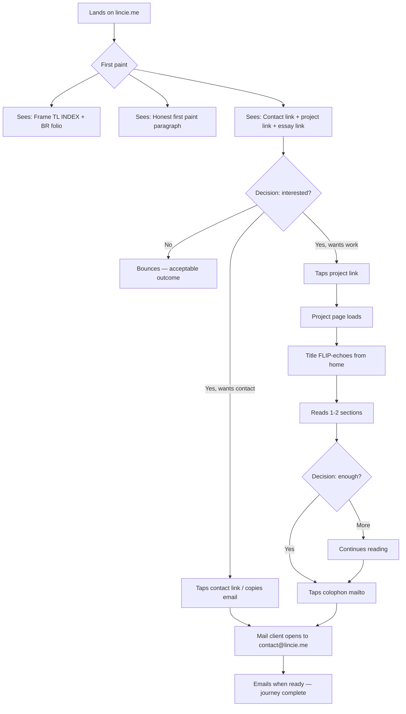
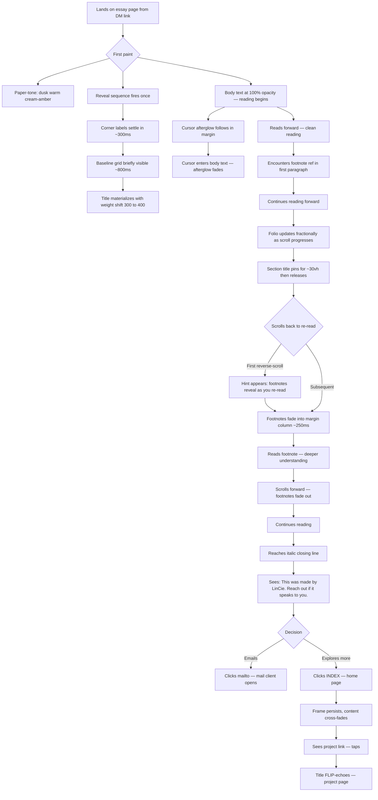
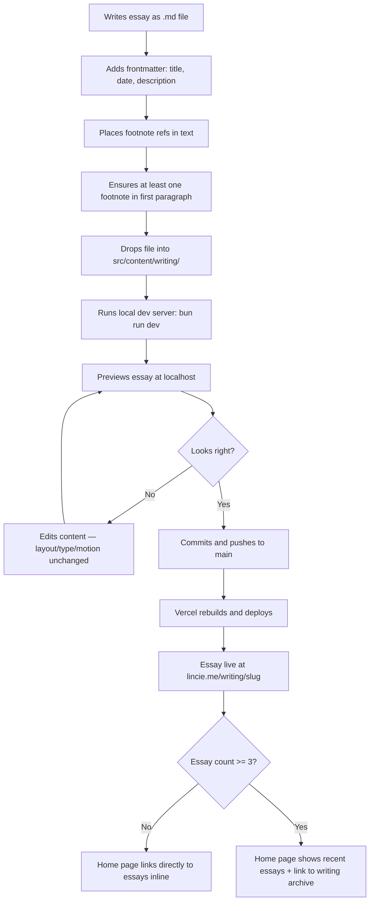
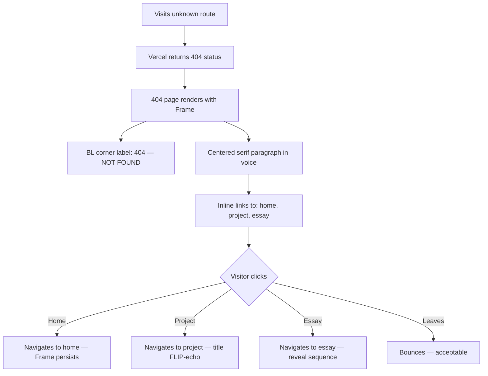

# UX Design Specification lincie

**Author:** LinCie
**Date:** 2026-05-21

---

## Executive Summary

### Project Vision

A personal site for LinCie — a thinker who builds. Engineering, research, and design are expressions of the same considered voice. The site does not announce, summarize, or sell; it exhibits and reads. The creative direction is "The Quiet Atelier with a Warm Trace": a Bauhaus-Swiss frame holding a single concession to warmth (a faint sumi-ink cursor afterglow). The site is utterly still at base; interaction creates one ripple that settles back to stillness.

The visual and motion vocabulary: Newsreader (variable serif with optical-size axis) + Commit Mono (static, anonymous, neutral), OKLCH warm-tinted neutrals with time-of-day paper-tone drift, asymmetric grid with corner labels at the four edges, strict 28px baseline grid, and animations that breathe (opacity, scale, blur, font-weight micro-shifts) rather than translate.

MVP delivers four surfaces: home, one project page, one essay, and a 404 fallback — with the colophon as footer on every page. Success is a small high-fit funnel: the right recruiter or collaborator reaches out unprompted because the site already answered their questions.

### Target Users

**Primary — Recruiters and hiring managers.** Scanning quickly on a tight time budget (often mobile, often 90 seconds). Lands via direct link from a resume or LinkedIn. Decides within seconds whether to keep reading. The site is balanced for this persona: honest first paint, one-click path to deeper work, cross-device signatures that fire on every visit.

**Secondary — Potential collaborators.** Designers, engineers, researchers considering working with LinCie. Lands via referral or social. Reading carefully on desktop, looking for taste, rigor, and a compatible working voice. Rewarded by long-form behaviors: reverse-scroll footnotes, cursor afterglow, section pin, project spine.

**Tertiary — Curious visitors.** Drawn in from a writing piece or a trusted referral. Not deciding anything; spending time. Rewarded by depth and patient pacing.

**Builder-as-user — LinCie.** Publishes new essays and project pages as Markdown files without per-page design work. The content pipeline is frictionless; layout, type, and motion stay constant.

### Key Design Challenges

1. **Dual-audience tension.** The primary persona (recruiter, mobile, 12 seconds) and secondary persona (collaborator, desktop, 30 minutes) have fundamentally different attention budgets. The UX must serve both without compromise — honest first paint for speed, long-form depth for reward.
2. **Signature moves invisible to most visitors.** The reverse-scroll footnote reveal and cursor afterglow are disabled on mobile and under reduced-motion. The site must be equally strong without them; these differentiators cannot be load-bearing for the primary persona.
3. **Navigation without navigation chrome.** No top nav, no sidebar, no breadcrumbs. The Frame corner labels and inline contextual links are the entire wayfinding system. This must feel intuitive, not lost — especially for a recruiter who has never seen this pattern before.
4. **Motion that decorates, never gates.** Every animation runs on top of already-visible, already-correct content. The reduced-motion path delivers the same information and emotional register, just instantly. Body opacity is 100% at first paint; the reveal sequence decorates, it does not unveil.
5. **Content-count scaling.** The home page must feel complete with 1 project and 1 essay (MVP), with 2 of each (intermediate), and with 3+ of each (steady state) — without redesign at any threshold.
6. **Contact visibility for the primary persona.** The mailto in the colophon must not be the only contact surface a mobile recruiter encounters. One inline contact link must be visible in the first viewport on mobile — addressed at design time, not deferred.

### Design Opportunities

1. **Reverse-scroll footnote reveal as identity.** A genuinely original interaction that embodies the maker's working style (going back, annotating, considered). No other portfolio has this. It is the "that's cool" moment for the collaborator persona.
2. **Typography as the entire brand.** With no accent color, no imagery on the home page, and no UI chrome, the type system carries 100% of the personality. The optical-size axis doing the hierarchy work is itself a craft statement visible to anyone who notices type.
3. **The Frame as ambient wayfinding.** Corner labels (INDEX, live local time, section label, folio) provide orientation without demanding attention — museum-quality environmental signage rather than navigation UI. The folio updating fractionally as you scroll is a quiet delight.
4. **Paper-tone drift as returning-visitor reward.** Visitors who return at different times of day see a subtly different page. Pre-dawn cool grey-cream, midday warm white-cream, dusk warm cream-amber, night cool warm-grey. Almost imperceptible per visit; a quiet signal of care for those who notice.
5. **The content pipeline as UX.** LinCie drops a Markdown file, pushes, and the essay is live with the same typography, frame, cursor, scroll, and reveal behavior as every other page. The authoring experience is part of the design.

### Key Decisions from Roundtable Review

**Recruiter first-viewport impression.** The one-sentence answer to "what does the recruiter conclude in 12 seconds?" is: *This person can build elegant websites.* The first viewport communicates craft through typography, restraint, and a clear statement of what LinCie does.

**Contact visibility.** Addressed at design time (not deferred to v1.1). One inline contact link visible in the first viewport on mobile, in addition to the colophon mailto. This is not chrome — it is survival for the primary persona.

**font-display: optional (Option A).** Keep `font-display: optional` for Newsreader. The risk of a cold-cache recruiter seeing Georgia instead of Newsreader is small given self-hosted edge CDN + preload + target audience on good connections. The metric-matched Georgia fallback preserves line breaks and vertical rhythm. Add a visual validation step: render both faces side by side at display size and confirm the vibe holds. If Georgia at hero size looks noticeably different in character despite matching metrics, revisit.

**Footnote content rule.** Footnotes must never contain information required to understand the main text. They are supplementary — the reverse-scroll reveal is a decoration, not a gate.

**Mobile identity.** Acknowledged that mobile loses the cursor afterglow and reverse-scroll footnotes. The cross-device signatures (title FLIP-echo, page reveal sequence) carry the brand on mobile. The Frame corner labels and typography discipline are the mobile identity.

**404 as brand moment.** The 404 page serves a brand purpose: it demonstrates voice and care even at the edges. A single serif paragraph in voice with inline links back to the work. Not an afterthought — a deliberate expression of the "considered" principle.

## Core User Experience

### Defining Experience

The core user action is **reading**. The site's primary value is delivered through the act of reading typography on paper. Every design decision serves this act: the baseline grid creates rhythm, the damped scroll creates pace, the section pin maintains context, the reverse-scroll footnotes reward re-reading, and the cursor afterglow acknowledges presence without interrupting attention.

For the recruiter, reading is a 12-second scan of the first viewport. The honest first paint communicates "this person can build elegant websites" through typography, restraint, and a clear one-clause statement of what LinCie does. One inline contact link is visible without scrolling. One click reaches deeper work.

For the collaborator, reading is a 30-minute immersion in an essay or project page. The long-form behaviors (drop caps, section pin, reverse-scroll footnotes, cursor afterglow, project spine) reward sustained attention. The site behaves the way the maker thinks: edited, considered, willing to go back.

For LinCie, the defining experience is **publishing without friction**. Drop a Markdown file, push, and the essay is live with the same typography, frame, and motion as every other page. Two commands from draft to live.

### Platform Strategy

**Primary platform:** Static web, deployed on Vercel at `lincie.me`. Astro 6 static output — no SSR runtime, no client-side router beyond Astro View Transitions.

**Device strategy:** Mobile-first for the primary persona (recruiter), desktop-optimized for the secondary persona (collaborator). The site is responsive but not identical across devices:
- **Mobile (`pointer: coarse`):** Native scroll, no cursor afterglow, no damped scroll, no reverse-scroll footnote reveal. Cross-device signatures (title FLIP-echo, page reveal sequence) still fire. Footnotes appear in a below-content list immediately. Two of four corner labels fold into the colophon (keep TL `INDEX` and BR folio).
- **Desktop (`pointer: fine`):** Full experience — damped scroll, cursor afterglow, reverse-scroll footnotes, section pin, project spine. All four corner labels visible.
- **Reduced motion:** All animations paint to final state instantly. Footnotes visible at all times. Content arrives immediately with full information.

**Offline:** Not supported. No service worker, no PWA. Static deploy means the site is always available when the network is.

**Font loading strategy:** `font-display: optional` with metric-matched Georgia fallback. Self-hosted on Vercel edge CDN with preload. Accept the tiny cold-cache window where Georgia renders instead of Newsreader — the metric-matched fallback preserves rhythm and line breaks. Visually validate the fallback at display size during implementation.

### Effortless Interactions

**Finding what LinCie does** — the first viewport answers this before any interaction. No scroll required, no animation required, no JavaScript required.

**Reaching deeper work** — one click from home to the project page or essay. No intermediate index at MVP. No navigation puzzle.

**Reaching out** — one inline contact link visible in the first viewport on mobile. The colophon mailto on every page. The italic closing line on every essay. Three surfaces, zero friction.

**Reading without interruption** — body text at 65–75ch measure, 28px baseline grid, damped scroll on desktop, cursor afterglow that vanishes inside body text. The site protects the reading act.

**Publishing new content** — LinCie drops a Markdown file with valid frontmatter, pushes to main, and the essay is live. No per-page design decisions. No template selection. The content pipeline is two commands: commit, push.

### Critical Success Moments

**The 3-second verdict (recruiter).** The recruiter lands on the home page. Within 3 seconds, they see: a clean serif paragraph stating what LinCie does, a named project link, a named essay link, and a contact surface. They form the impression "this person can build elegant websites" and either tap deeper or copy the email. If this moment fails — if the page is blank, loading, or unclear — the recruiter bounces.

**The "that's cool" moment (collaborator).** The collaborator is reading an essay on desktop. They scroll back to re-read a paragraph. Footnotes they didn't notice the first time fade into the margin. They realize the site behaves the way the maker thinks — going back, annotating, considered. This is the signature moment. If it never fires (because the visitor never scrolls up), the site is still strong — but the differentiator is lost.

**The publish moment (LinCie).** LinCie finishes writing an essay, drops the file, pushes, and sees it live with the same quality as every other page. No design work. No debugging. If this moment has friction — if the layout breaks, if footnotes don't render, if the drop cap is wrong — LinCie stops publishing, and SM-2 fails.

**The return visit (any persona).** A visitor returns at a different time of day. The paper tone is subtly different — warmer at dusk, cooler at dawn. They may not consciously notice, but the site feels alive, not frozen. This is the long-half-life reward.

### Experience Principles

1. **Reading is the interaction.** Every design decision serves the act of reading. If a feature interrupts reading, it fails. If it enhances reading, it earns its place.

2. **The empty page is already right.** Before any JavaScript loads, before any animation fires, the static HTML + CSS page must feel quiet, considered, and on-brand. If it doesn't, no motion will save it.

3. **One ripple, then stillness.** Each interaction creates exactly one response that settles back to rest. No cascading effects, no chain reactions, no ambient motion for its own sake.

4. **Progressive depth, not progressive disclosure.** Everything is visible and accessible from the start. Depth is rewarded (reverse-scroll footnotes, returning at different times) but never required. The surface is complete on its own.

5. **The site disappears.** The Frame, the typography, the motion — none of it should call attention to itself. The visitor should feel settled without knowing why. If someone says "cool animation," the animation is too loud.

## Desired Emotional Response

### Primary Emotional Goals

**The site should make visitors feel settled.** Not impressed, not entertained, not sold to — settled. The way you feel in a well-designed room where everything is in its right place and nothing demands your attention. You notice the quality only when you leave and other sites feel noisy by comparison.

**Per persona:**

- **Recruiter:** Confidence. "This person knows what they're doing. I don't need to see more to know the quality is real." The emotion is trust earned through evidence, not claimed through words.
- **Collaborator:** Recognition. "This person thinks the way I think." The reverse-scroll footnote reveal, the cursor that respects reading, the patient pacing — these are signals of a compatible working mind. The emotion is kinship.
- **Curious visitor:** Calm attention. The site rewards being present without asking anything in return. No newsletter popup, no CTA, no "subscribe." Just depth, available if you want it.

### Emotional Journey Mapping

**First contact (0–3 seconds):**
- Feel: Quiet confidence. The page is already right — no loading state, no flash, no announcement.
- Avoid: Confusion ("what is this?"), overwhelm ("too much"), emptiness ("is this broken?").

**Orientation (3–12 seconds):**
- Feel: Clarity. "I know what this person does and how to reach them or see their work."
- Avoid: Searching ("where do I click?"), uncertainty ("is there more?").

**Engagement (12 seconds – 30 minutes):**
- Feel: Immersion. The reading experience is so clean that the visitor forgets they're on a website. Time passes without friction.
- Avoid: Distraction (animations pulling attention from text), impatience (scroll-jacking, slow reveals that gate content).

**Discovery (reverse-scroll, return visit, paper-tone drift):**
- Feel: Quiet delight. "Oh — that's considered." A small reward for paying attention, never announced.
- Avoid: Surprise that breaks immersion, cleverness that calls attention to itself.

**Exit / memory:**
- Feel: Residue of quality. The visitor leaves with an impression of care and restraint. When they think of LinCie later, they remember the feeling, not a specific feature.
- Avoid: Forgettability (the site blends with every other portfolio), gimmick memory ("that site with the weird scroll thing").

### Micro-Emotions

**Confidence over confusion.** The Frame corner labels, the honest first paint, the one-click paths — every element says "you're in the right place, here's what's here." No mystery navigation, no hidden menus.

**Trust over skepticism.** The site demonstrates craft rather than claiming it. No "I'm passionate about" copy, no buzzword lists, no hero metrics. The typography, the spacing, the restraint — these are the proof. Trust is earned by evidence.

**Calm over anxiety.** Damped scroll, generous whitespace, patient pacing, no countdown timers, no urgency signals, no "limited time" language. The site has nowhere to be. Neither does the visitor.

**Recognition over alienation.** For the collaborator persona specifically: the reverse-scroll footnotes, the cursor that vanishes during reading, the section pin — these are signals of a shared sensibility. "This person edits the way I edit. This person re-reads the way I re-read."

**Accomplishment over frustration.** The recruiter finds the email in seconds. The collaborator finishes an essay feeling they've spent time well. LinCie publishes without debugging. Every user journey ends with its job done, cleanly.

### Design Implications

| Emotional Goal | UX Design Approach |
|---|---|
| Settled / quiet confidence | No animation gates content. Body opacity 100% at first paint. Frame already present before JS loads. |
| Trust through evidence | Typography carries the brand — no accent color, no imagery needed. The craft IS the proof. |
| Calm attention | Damped scroll, generous "ma" gaps, 65–75ch measure, no sticky chrome, no popups, no interruptions. |
| Quiet delight (discovery) | Reverse-scroll footnotes, paper-tone drift, folio updating fractionally — rewards that never announce themselves. |
| Recognition (collaborator) | Cursor afterglow that respects reading, section pin that maintains context, project spine as in-page nav. |
| Confidence in wayfinding | Frame corner labels always present, honest first paint with clear content, one-click paths to deeper work. |
| Residue of quality (memory) | Consistent voice across all surfaces, no page that breaks the spell, the 404 in voice, the colophon as craft statement. |

### Emotional Design Principles

1. **Earn trust, don't claim it.** The site never says "I'm detail-oriented" — it demonstrates detail-orientation through pixel-level care, restrained timing, and edited copy. Every claim is replaced by evidence.

2. **Quiet delight over loud surprise.** Rewards are discovered, never announced. The reverse-scroll footnotes, the paper-tone drift, the folio — these are for visitors who pay attention. They never interrupt visitors who don't.

3. **Respect over engagement.** The site respects the visitor's time, attention, and autonomy. No dark patterns, no engagement hooks, no "you might also like." If the visitor leaves after 3 seconds, that's fine. If they stay for 30 minutes, that's also fine. The site has no opinion about how long you stay.

4. **Stillness as emotional baseline.** The resting state is calm. Every interaction creates one ripple that settles back. The emotional register never spikes — no excitement, no urgency, no drama. Considered, disciplined, warm.

5. **The feeling outlasts the feature.** Visitors should remember how the site made them feel (settled, respected, quietly impressed) rather than what it did (the scroll thing, the cursor thing). If a feature is memorable as a feature, it's too loud.

## UX Pattern Analysis & Inspiration

### Inspiring Products Analysis

**Andermatt Real Estate (andermatt-realestate.ch)**

A luxury Swiss Alpine real estate site that demonstrates how generous vertical pacing and confident typography create an impression of quality without shouting. Key UX observations:
- Each section occupies a full viewport height — true "ma" gaps between content blocks, not just margins.
- Display serif headlines paired with clean metadata create hierarchy through type alone.
- Navigation is minimal (language toggle + one CTA) — the page itself is the navigation through vertical scroll.
- Imagery is large, atmospheric, and low-contrast — it supports the text rather than competing with it.
- The pacing is unhurried: you scroll through the story at the site's pace, not yours.

**Relevance to lincie:** The vertical pacing model (one idea per viewport, generous breathing room) maps directly to the "ma" gaps and patient pacing principles. The serif-display + metadata pairing validates the Newsreader + Commit Mono approach. The minimal navigation (no hamburger menu, no sticky bar) proves that a luxury/quality site can function with almost no chrome.

**Caution:** Andermatt's pacing is a luxury tax — their users *want* to linger. A recruiter is doing triage. Transfer the *confidence* of whitespace, not the *amount*. On mobile, compress the viewport math; desktop can breathe, mobile earns every pixel.

---

**Design Campus Dresden (designcampus.org)**

A curatorial platform that uses geographic coordinates as a persistent identity marker — monospace, precise, institutional. Key UX observations:
- Coordinates (`51°0'30"N 13°52'16"E`) appear in the header and footer as a quiet identity anchor — not navigation, not content, just presence.
- Navigation is four words (Museum / School / Lab / Network) — the entire information architecture in one line.
- Each section follows the same pattern: large headline, two-sentence description, single "Learn more" link. No variation, no surprise.
- The newsletter signup is present but not aggressive — it sits at the bottom, in context, without a popup.
- The overall impression is "institutional confidence" — the site knows what it is and doesn't need to explain itself.

**Relevance to lincie:** The coordinates-as-identity-marker pattern maps directly to the Frame corner labels (INDEX, local time, section label, folio) — persistent monospace metadata that provides orientation without demanding attention. The four-word navigation validates the minimal wayfinding approach. The repeating section pattern (headline + short text + one link) is exactly the home page composition at MVP.

**Caution:** Coordinates work because they're *unexpected* for a museum. LinCie's equivalent unexpected-but-authentic markers are the live local time and the fractional folio — information that's precise, personal, and quietly alive.

---

**L-A-K / Luis August Krawen (l-a-k.com)**

A visual artist's portfolio that is radically minimal — the frame disappears entirely. Key UX observations:
- The home page is essentially empty — just the name and navigation links (About / Work / Timeline). No hero, no tagline, no imagery.
- The about page is pure prose — a considered biography with no visual decoration. Contact is a single mailto link at the bottom.
- Navigation is three words. The entire site structure is visible at a glance.
- The Instagram link is the only social presence — one platform, not a row of icons.
- The emotional register is absolute confidence: "I don't need to explain what I do. Look at the work."

**Relevance to lincie:** This is the closest spiritual reference to lincie's approach — a personal site where the frame disappears and the work speaks. The radical minimalism of the home page (name + links, nothing else) validates the "no hero image, no tagline, no announcement" approach. The single mailto as the only contact surface is exactly the colophon pattern.

**Caution:** L-A-K's radical minimalism assumes fame — the artist's reputation precedes the site. LinCie's recruiter arrives cold. The honest first paint paragraph is non-negotiable. Also: L-A-K is radically JS-heavy under the hood (required browser rendering to fetch content), built on a fundamentally different architecture than Astro static. Transfer the *feeling*, not the implementation approach.

### Transferable UX Patterns

**Navigation Patterns:**
- **Persistent corner identity markers** (from Design Campus coordinates → lincie Frame corner labels). Monospace metadata that orients without navigating. The `INDEX` link in TL is critical — it's the only breadcrumb when a recruiter lands on a project page from a shared link.
- **Minimal word-count navigation** (from all three sites). Andermatt: one CTA. Design Campus: four words. L-A-K: three words. Lincie: `INDEX` in the corner + inline links in prose.
- **Vertical scroll as navigation** (from Andermatt). The page itself is the journey; no need for a nav bar when the content is the map.

**Interaction Patterns:**
- **One idea per viewport** (from Andermatt). Each section gets breathing room. Maps to lincie's "ma" gaps and project index bands (30–40vh each). On mobile, compress to earn every pixel.
- **Single-link sections** (from Design Campus). Headline + short text + one link. No choice paralysis. Maps to lincie's home page composition (one project link, one essay link).
- **Prose as the primary interface** (from L-A-K). The about page is just text — no cards, no grids, no visual decoration. Maps to lincie's essay pages and the "reading is the interaction" principle.

**Visual Patterns:**
- **Serif display + monospace metadata** (from Andermatt and Design Campus). The pairing creates hierarchy through type contrast alone, without color or weight extremes.
- **Generous whitespace as confidence signal** (from all three). Empty space communicates quality — but the *amount* is device-dependent. Desktop breathes; mobile earns every pixel.
- **Contact as afterthought, not CTA** (from L-A-K). A mailto at the bottom of the about page — present, findable, never pushed. Maps to lincie's colophon pattern (with the addition of one first-viewport contact link for the recruiter persona).

### Anti-Patterns to Avoid

**From Andermatt (what NOT to transfer):**
- Cookie consent banners and privacy popups. Lincie sets no cookies — absent by design.
- CTA buttons in the header. Lincie has no buttons, no CTA energy.
- Contact forms with multiple fields. Lincie uses mailto only.
- Video autoplay. Lincie has no video, no media that plays without consent.
- Full-viewport "ma" gaps on mobile. Luxury pacing on a recruiter's phone becomes "why is there so much empty space."

**From L-A-K (what to be careful about):**
- The home page is too empty for lincie's recruiter persona. L-A-K can afford radical emptiness because the artist's reputation precedes the site. LinCie needs evidence in the first viewport.
- The heavy JS architecture. L-A-K's minimalism is a visual lie over a thick client runtime. Lincie achieves the same feeling with Astro static + View Transitions — fundamentally different implementation.

**From the broader portfolio landscape:**
- Hero-metric templates (big number, small label). None of the three references use this — validation that it's correctly excluded.
- Hamburger menus on desktop. All three references use visible, minimal navigation.
- Social proof rails or testimonial carousels. None present in any reference.
- Scroll-jacking or snap scrolling. Andermatt uses generous sections but native scroll behavior.

### Design Inspiration Strategy

**What to Adopt:**
- **Persistent monospace identity markers** (Design Campus → Frame corner labels). Proven pattern for institutional confidence without chrome.
- **One idea per viewport with generous gaps on desktop** (Andermatt). Proven pattern for quality pacing — compressed on mobile.
- **Prose as primary interface** (L-A-K). Proven pattern for "the work speaks."
- **Minimal word-count navigation** (all three). Proven pattern for confident wayfinding.
- **Single-link sections** (Design Campus). Proven pattern for the home page composition.

**What to Adapt:**
- **Andermatt's full-viewport sections** → 30–40vh project index bands on desktop, compressed on mobile. Text-heavy content doesn't need full viewport height.
- **Design Campus's repeating section pattern** → home page's project/essay links (headline + one-line description + link, repeated per item).
- **L-A-K's radical emptiness** → add the honest first paint paragraph. Keep the emptiness everywhere else, but the first viewport must communicate evidence.
- **Andermatt's pacing** → transfer the *confidence* of whitespace, not the *amount*. The recruiter needs evidence, not evocation.

**What to Avoid:**
- Andermatt's CTA energy and form-based contact. Conflicts with the no-buttons, mailto-only rule.
- L-A-K's assumption of fame. LinCie's recruiter arrives cold — the first viewport must earn attention.
- Any pattern that requires imagery to function. Lincie's home page works without images.
- Any pattern that hides navigation behind a toggle. All wayfinding is always visible.

### Roundtable Insights (Folded In)

**Memorability vs. mood (from product review).** These references all model atmosphere, but SM-1 requires "referencing something specific." The site needs memorable specifics — not just mood. The first viewport needs evidence that creates a conclusion ("this person builds elegant things"), not just a feeling. The project title and the essay title on the home page are the memorable specifics; they must be named well enough to stick.

**Animation priority order (from engineering review).** The 60KB gzip budget means every animation feature competes for the same bytes. The UX spec declares this priority order for implementation — cut from the bottom if budget gets tight:
1. Page transitions (View Transitions API — near-zero JS cost, highest cross-device impact)
2. Page reveal sequence (one-shot GSAP timeline — small, fires once, cross-device)
3. Cursor afterglow (GSAP ticker — moderate cost, desktop-only, high brand value)
4. Damped scroll / ScrollTrigger.normalizeScroll() (moderate cost, desktop-only)
5. Section pin (ScrollTrigger — moderate cost, desktop-only)
6. Reverse-scroll footnote reveal (ScrollTrigger — moderate cost, desktop-only, signature move)
7. Project spine scroll indicator (ScrollTrigger — small cost, desktop-only)
8. Fog-lifting section blur (ScrollTrigger — small cost, desktop-only, lowest priority)

**Mobile pacing (from UX review).** Desktop breathes with generous "ma" gaps. Mobile compresses — every pixel earns its place. The home page on mobile is a single screen: honest first paint paragraph, contact link, project link, essay link. No poetic emptiness on a 390px screen. The collaborator's 30-minute reading experience is desktop-optimized; the recruiter's 12-second scan is mobile-optimized. One viewport, two readings.

**The "lost" state (from UX review).** If a recruiter lands on a project page from a shared link (not the homepage), the persistent `INDEX` corner label is their only breadcrumb. It must be visible, tappable, and obviously a link home. On mobile, it's the primary escape hatch. Not decoration — survival.

**First-viewport contact link (from UX review).** "Say hello" in 14px body text is easy to miss on a 390px screen. The contact link in the first viewport needs to be visually distinct without becoming a button — perhaps the only link in the opening paragraph, or set at a slightly different weight. It must have an adequate tap target (minimum 44×44px hit area) while remaining typographically quiet.

## Design System Foundation

### Design System Choice

**Custom design system built on Tailwind CSS utilities.** No pre-built component library. No Material Design, no Chakra UI, no Tailwind UI component kit. Every component is bespoke, purpose-built for this site's specific vocabulary.

This is the only correct choice for a project where:
- Typography IS the brand (no component library carries Newsreader + Commit Mono with optical-size axis handling)
- The component set is intentionally tiny (fewer than 15 distinct elements)
- Every visual decision is locked to a specific aesthetic that no existing system matches
- The anti-references explicitly reject the patterns that component libraries encode (cards, tiles, buttons, hero sections)
- The 60KB JS budget and no-new-dependencies rule eliminate runtime-heavy design systems

### Rationale for Selection

1. **The design system already exists.** DESIGN.md defines the complete token set (colors in OKLCH, type scale, baseline grid, animation tokens), component primitives (inline links, corner frame, colophon, project bands, cursor afterglow, page reveal), and named rules (Bach Rule, No-Shadow Rule, No-Accent Rule, etc.). This is a custom system by definition.

2. **Component count is tiny.** The entire site uses fewer than 15 distinct UI elements. A component library would be overhead for a system this small. Every element is hand-crafted to the specific aesthetic.

3. **Tailwind CSS provides the utility layer.** Tailwind handles responsive design, spacing, typography utilities, and state variants (hover, focus-visible, reduced-motion). Custom CSS is used only for what Tailwind can't express (drop cap pseudo-element, hanging punctuation, baseline grid alignment, OKLCH custom properties).

4. **GSAP provides the motion layer.** All complex animation (cursor afterglow, reveal sequence, scroll-linked behaviors, page transitions) is GSAP-driven. Tailwind handles simple transitions (hover states, focus states, opacity changes).

5. **No runtime cost.** A custom system built on Tailwind compiles to static CSS. No JavaScript framework, no component runtime, no hydration cost. The only client JS is GSAP + site scripts within the 60KB budget.

### Implementation Approach

**Token layer (CSS custom properties):**
- `--paper`, `--ink`, `--meta`, `--hairline` — OKLCH color tokens
- `--paper-tone` — time-of-day drift value
- `--baseline` (28px), `--type-scale-ratio` (1.25) — grid tokens
- `--ease-settle`, `--ease-mark`, `--dur-quick`, `--dur-breath`, `--dur-arrive` — animation tokens
- All tokens defined once in a global stylesheet; every component references them

**Utility layer (Tailwind CSS):**
- Responsive breakpoints, spacing scale, typography utilities
- Custom Tailwind theme extending the token values
- Prettier plugin for consistent class ordering
- State variants: `hover:`, `focus-visible:`, `motion-reduce:`, `pointer-coarse:`

**Component layer (Astro components):**
- `<Frame>` — persistent corner labels with `transition:persist`
- `<Colophon>` — footer block with type credits, year, mailto, social links
- `<DropCap>` — 3-line opening capital via pseudo-element
- `<InlineLink>` — inkstroke underline animation, external link annotation
- `<ProjectBand>` — index band with title, meta, hover-revealed hero
- `<ProjectSpine>` — vertical hairline with tick marks and scroll indicator
- `<CursorAfterGlow>` — GSAP-driven cursor trace (desktop only)
- `<RevealSequence>` — one-shot GSAP timeline for first paint
- `<FootnoteReveal>` — reverse-scroll behavior (desktop only)
- `<SectionPin>` — ScrollTrigger-driven title pin
- `<Folio>` — fractional scroll-position indicator
- `<LocalTime>` — live local time with setInterval

**Content layer (Astro Content Collections):**
- Markdown/MDX files with typed frontmatter schemas
- Project pages under `src/content/projects/`
- Essays under `src/content/writing/`
- Automatic slug generation, type-safe queries

### Customization Strategy

There is no customization of an external system — the system is custom from the ground up. The "customization" is the design system itself:

**What's fixed (never changes):**
- Newsreader + Commit Mono typeface pairing
- OKLCH color tokens with warm chroma ≥ 0.005
- 28px baseline grid
- No accent color, no shadows, no buttons
- Frame corner label positions and content

**What's parameterized (changes per content):**
- `transition:name` scoped per project slug
- Section labels per route (home blank, project `WORK`, essay `WRITING`, 404 `404 — NOT FOUND`)
- Paper-tone drift band based on local time
- Folio total based on page section count
- Drop cap presence (long-form pages only, not home or index)

**What scales (grows with content):**
- Project bands in the index (1 at MVP → 3–5 at steady state)
- Essay list on the home page (1 at MVP → 3+ triggers archive page)
- Footnote count per essay (variable, author-controlled)

## Defining Interaction

### The Defining Experience

**"The site reads you reading."**

The defining experience is not a single action — it's a quality of responsiveness to attention. The site notices *how* you're engaging and adjusts its behavior accordingly:

- **Forward scroll** → clean reading. Footnotes hidden. Body text uninterrupted.
- **Reverse scroll** → considered marginalia surfaces. Footnotes fade into the margin. The site rewards going back.
- **Cursor over body text** → afterglow vanishes. The site steps aside for reading.
- **Cursor in margin/whitespace** → afterglow returns. The site acknowledges presence.
- **Scroll position** → folio updates fractionally. Section label changes. The Frame knows where you are.
- **Time of day** → paper tone drifts. The site is alive across visits.

If someone described this site to a friend: *"It's a portfolio that rewards re-reading. If you scroll back, footnotes appear that weren't there before."*

This is the interaction that, if nailed, makes everything else follow — because it embodies the maker's identity (going back, annotating, considered) in the medium itself.

### User Mental Model

**The recruiter's mental model:** "This is a portfolio. I scan, I decide, I move on or I reach out." They bring the expectation of a static page with links. The site meets this expectation perfectly — honest first paint, clear links, visible contact. The recruiter never encounters the defining interaction because they don't scroll back. That's fine. The site is strong without it.

**The collaborator's mental model:** "This is someone's work. I'm reading to understand how they think." They bring the expectation of a long-form reading experience — like a well-typeset essay or a book. The site meets this expectation and then exceeds it: the reverse-scroll footnote reveal is a surprise that reframes the entire experience. "Oh — this site behaves the way the maker thinks."

**The curious visitor's mental model:** "I followed a link. Let me see what's here." They bring no expectation. The site rewards their curiosity with depth — the longer they stay, the more they discover (paper-tone drift on return visits, footnotes on re-read, the folio counting their progress).

**Key insight:** The defining interaction is *invisible to the primary persona* and *revelatory to the secondary persona*. This is intentional. The recruiter gets a strong, clean portfolio. The collaborator gets a portfolio that demonstrates a way of thinking. The defining interaction is a filter — it self-selects for the audience that values depth.

### Success Criteria

**The defining interaction succeeds when:**

1. **A collaborator scrolls back and discovers footnotes.** The moment of recognition — "oh, that's considered" — fires. They feel kinship with the maker's working style.

2. **The hint fires once and is sufficient.** On the first reverse-scroll of the session, the monospace hint ("footnotes reveal as you re-read") appears, communicates, and fades. The visitor understands the mechanic without needing a tutorial.

3. **Forward reading is never interrupted.** A visitor who never scrolls back has a complete, uninterrupted reading experience. They never know footnotes exist in the margin. The defining interaction is additive, never subtractive.

4. **The cursor afterglow respects reading.** When the cursor enters body text, the afterglow fades within ~200ms. When it returns to whitespace, the afterglow returns. The transition is imperceptible — the visitor feels "the site is quiet when I'm reading" without consciously noticing the mechanism.

5. **The folio and section label update without drawing attention.** The Frame knows where you are, but it never announces it. The information is there when you glance at the corner; it never pulls your eye.

### Novel UX Patterns

**Novel (requires no education, discovered organically):**

- **Reverse-scroll footnote reveal.** Genuinely original. No other site does this. But it requires no education because the hint fires once on first reverse-scroll, and the behavior is intuitive once discovered (scroll up = more context appears). The one-time hint is the entire "onboarding."
- **Cursor afterglow that respects reading zones.** Novel in implementation, but the user never needs to learn it. They simply feel that the site is quieter when they're reading. The mechanism is invisible; the effect is felt.

**Established (familiar patterns used well):**

- **Inline footnote references** (`[1]`, `[2]`). Standard essay typography. Visitors know what these mean.
- **Persistent corner labels.** Familiar from museum signage, book folios, and editorial layouts. No learning curve.
- **View Transitions title morph.** Familiar from native app navigation. The title moves from list to detail page — visitors expect this.
- **Damped smooth scroll.** Familiar from high-end editorial sites. Visitors feel "this scrolls nicely" without knowing why.

**Combined (familiar + novel):**

- **The Frame as wayfinding.** Corner labels are familiar (museum signage). Live local time updating is novel but requires no education — it's just information, always correct. The combination creates "ambient awareness" without any learning curve.

### Experience Mechanics

**1. Initiation — How the defining interaction begins:**

The visitor reads an essay or project page. They encounter a footnote reference (`[1]`) in the text. They continue reading forward. At some point — curiosity, re-reading, or the one-time hint — they scroll backward.

**2. Interaction — What happens:**

- ScrollTrigger detects reverse scroll direction.
- Footnotes in the margin column (desktop) fade from `opacity: 0` to `opacity: 1` over ~250ms.
- On the first reverse-scroll of the session on this page, the monospace hint ("footnotes reveal as you re-read") fades in near the spine, holds for ~2 seconds, then fades out. Never repeats.
- Forward scroll hides footnotes again (fade to `opacity: 0` over ~250ms).
- On mobile (`pointer: coarse`), the reverse-scroll behavior is disabled; footnotes appear in a below-content list immediately and are always visible.

**3. Feedback — How the visitor knows it's working:**

- Footnotes appear. That's the feedback. No toast, no animation flourish, no sound. Just: content that wasn't there is now there.
- The hint text confirms the mechanic on first encounter.
- Subsequent reverse-scrolls produce the same result without the hint — the visitor has learned the pattern.

**4. Completion — What success looks like:**

- The visitor reads a footnote. They understand something deeper about the essay or project.
- They scroll forward again. Footnotes disappear. Clean reading resumes.
- They leave the page with the impression: "this site is considered. It rewards attention."
- They may or may not consciously remember the mechanic. What they remember is the feeling.

## Visual Design Foundation

### Color System

**Approach:** OKLCH-only tokens with warm chroma. No accent color. No pure greys. Warmth lives in the paper-tone drift and cursor afterglow, never in a hue applied to elements.

**Token set:**

| Token | Role | OKLCH anchor | Notes |
|---|---|---|---|
| `--paper` | Base surface | ~97% L, 0.008 C, 80 H | Drifts via `--paper-tone` based on local time |
| `--ink` | Body text, display headlines | ~18% L, 0.008 C, 80 H | Tinted toward paper hue, never #000 |
| `--meta` | Corner labels, folio, captions | ~50% L, 0.005 C, 80 H | ~30–40% body-ink contrast |
| `--hairline` | Project spine, rare separators | ~85% L, 0.005 C, 80 H | Almost imperceptible |

**Time-of-day paper-tone drift (4 bands):**
- Pre-dawn (04:00–07:00): cool grey-cream
- Midday (07:00–16:00): warm white-cream
- Dusk (16:00–20:00): warm cream-amber
- Night (20:00–04:00): cool warm-grey

Each band must clear WCAG 2.2 AA contrast (≥4.5:1 body text, ≥3:1 large text and corner labels). Exact OKLCH triples resolved during implementation against the typeface pairing.

**Named rules enforced:**
- No-Accent Rule: no brand color applied to any element
- Tinted Neutral Rule: every neutral carries chroma ≥0.005 toward the paper hue (warm yellow-orange family)
- No-Shadow Rule: box shadows forbidden everywhere

### Typography System

**Typeface pairing (committed):**
- **Display + Body:** Newsreader (variable, `wght` 200–800, `opsz` 6–72, `ital` 0–1; SIL OFL 1.1)
- **Label + Mono:** Commit Mono (static, weights 400 and 500, latin subset; SIL OFL 1.1)

**Type scale (modular ratio 1.25, root 18px):**

| Level | Family | Size | Weight | Line-height | Role |
|---|---|---|---|---|---|
| Display | Newsreader | clamp(2.5rem, 6.5vw, 4.25rem) | 400 | 1.05 | Project titles on index, name reveal |
| Headline | Newsreader | clamp(1.75rem, 3.2vw, 2.25rem) | 400 | 1.15 | Section openers in long-form |
| Title | Newsreader | 1.575rem | 500 | 1.3 | Subheads in essays/projects |
| Body | Newsreader | 1.125rem | 400 | 1.555 | Essay and project prose (65–75ch measure) |
| Label | Commit Mono | 0.75rem | 400 | 1.4 | Corner labels, folio, meta, footnotes |

**Optical-size axis:** `font-optical-sizing: auto` applied globally. Display optical at headline sizes, text optical at body, caption optical at labels. Never override via `font-variation-settings`.

**Special typography:**
- Drop cap: 3-line opening capital on long-form content. Newsreader display optical at ~600 weight. Cap-height = 3 × baseline (84px at 28px line-height). Hand-floated pseudo-element. Not on home page or short pages.
- Hanging punctuation: `hanging-punctuation: first` on body and headline blocks. Safari-only progressive enhancement.

**Font loading:**
- Newsreader normal latin: preloaded, `font-display: optional`
- Newsreader italic: loads on demand (used sparingly — italic closing line on essays)
- Commit Mono 400/500: loads on demand
- Metric-matched fallback: Georgia with `size-adjust`, `ascent-override`, `descent-override` for zero CLS

### Spacing & Layout Foundation

**Baseline grid:** 28px unit (derived from 18px root × 1.555 line-height). All vertical spacing snaps to multiples of 28px.

**Grid system:** Asymmetric Swiss/atelier grid. Not a standard 12-column grid — an intentionally asymmetric layout with:
- Wide content column (65–75ch body measure)
- Narrow margin column (for footnotes on desktop)
- Corner label positions (fixed at viewport edges)
- Generous "ma" gaps between sections (true empty viewport pauses)

**Spacing scale (multiples of baseline):**
- `1×` (28px): paragraph spacing, tight element gaps
- `2×` (56px): section internal spacing
- `3×` (84px): between-section gaps on mobile
- `4×–6×` (112–168px): "ma" gaps between project bands on desktop
- `8×+` (224px+): generous breathing room between major sections on desktop

**Responsive behavior:**
- Desktop: full asymmetric grid, margin column for footnotes, all four corner labels, generous "ma" gaps
- Mobile (<768px): single column, footnotes below content, two corner labels (TL + BR), compressed spacing (every pixel earns its place)

**Layout principles:**
- Content column never exceeds 75ch
- Margin column is for footnotes and asides only — never primary content
- Corner labels are fixed-position, never scroll with content
- The Frame (corner labels + grid) persists across page transitions
- "Ma" gaps are viewport-relative on desktop, compressed to fixed values on mobile

### Accessibility Considerations

**Color contrast:**
- Body text (`--ink` on `--paper`): ≥4.5:1 at every paper-tone band
- Corner labels (`--meta` on `--paper`): ≥3:1 as large text equivalent, or documented as decorative text (WCAG 1.4.3 exemption for incidental text) if 4.5:1 cannot be met at the specified ~30–40% contrast. Resolved at implementation against actual OKLCH values.
- Inline links: same contrast as body text (no color differentiation — underline on hover/focus is the affordance)

**Focus states:**
- All interactive elements have visible `:focus-visible` states
- Focus indicator: 2px paper-cream offset outline on the element's bounding box
- Inkstroke underline appears on `:focus-visible` for inline links (same as hover)
- Tab order follows document flow — no custom `tabindex` manipulation

**Motion accessibility:**
- All animations respect `prefers-reduced-motion: reduce`
- Reduced-motion path: content arrives instantly at final state, footnotes always visible, no cursor afterglow, no damped scroll, no section pin, no fog-lifting blur
- The reduced-motion experience delivers the same information and emotional register — just without temporal decoration

**Keyboard navigation:**
- All inline links keyboard-accessible
- Corner label `INDEX` link keyboard-accessible
- Footnote references link to footnote text; footnote text links back (bidirectional jump)
- No keyboard traps — the Frame never captures focus

**Semantic HTML:**
- `<article>` for project bands and essay content
- `<nav>` for the Frame's INDEX link (minimal, not a full nav element)
- `<footer>` for the colophon
- `<aside>` for footnotes in the margin column
- Heading hierarchy (`h1` → `h2` → `h3`) strictly maintained per page

## Design Direction Decision

### Design Directions Explored

The design direction for lincie was locked during the brainstorming session as **"The Quiet Atelier with a Warm Trace"** — a Bauhaus-Swiss frame holding a single concession to warmth. This was not a multi-direction exploration; it was a deliberate convergence from the Values Archaeology (quiet confidence, craft as proof, stillness with texture) through Analogical Thinking (tea room, Ozu, Bach, koi pond) to a single committed direction.

The direction was validated against 13 failure modes in the stress test and confirmed through the PRD review. No alternative directions were considered at this stage because the creative lock is the project's strength — indecision would weaken the coherence that makes the site work.

### Chosen Direction

**The Quiet Atelier with a Warm Trace**

A Bauhaus-Swiss atelier discipline (asymmetric grid, corner labels, monospace metadata, strict baseline grid, modular type scale) holding a single concession to warmth (the sumi-ink cursor afterglow). The structure leads; the atmosphere never overpowers it.

**Visual characteristics:**
- Utterly still at base. One ripple per interaction, settling back.
- Animations breathe (opacity, scale, blur, font-weight micro-shifts). Almost no x/y translation.
- Paper, ink, and one muted monospace tone. No accent color.
- Newsreader carries the entire typographic hierarchy through its optical-size axis.
- Commit Mono sits in its single lane: metadata, labels, folio, footnotes.
- Generous whitespace on desktop; compressed efficiency on mobile.

**What makes this direction unique (vs. the 2025 cream-paper editorial trend):**
- The reverse-scroll footnote reveal (no other portfolio has this)
- Newsreader + Commit Mono (not IBM Plex Mono, not Geist Mono)
- Time-of-day paper-tone drift (the site is alive across visits)
- Cursor afterglow with reading-zone awareness (vanishes over body text)
- The Frame as persistent wayfinding (not just decoration)

### Design Rationale

1. **Coherence over variety.** Every element reinforces every other element. The cursor respects reading just as the scroll dampens reading speed just as the hover doesn't shout just as the transitions keep the frame still. One voice across every interaction surface.

2. **The direction embodies the maker.** "The Quiet Atelier" is not a style applied to LinCie — it IS LinCie. Quiet confidence, considered craft, willing to go back and rewrite. The site behaves the way the maker thinks.

3. **Differentiation through restraint.** In a landscape of loud portfolios, the differentiator is what's absent: no accent color, no hero image, no buttons, no CTA, no sticky nav, no shadows, no cards. The absence is the statement.

4. **Long half-life.** The direction avoids every trend-bound aesthetic identified in the anti-references. Newsreader is not saturated. Commit Mono is not the default. The baseline grid and optical-size axis are timeless typographic principles, not 2025 trends.

### Implementation Approach

**HTML mockup generated:** `_bmad-output/planning-artifacts/ux-design-directions.html`

The mockup demonstrates all four MVP surfaces (home, project band, essay with drop cap, 404) plus the colophon, type scale, and hover language — rendered with system font fallbacks (Georgia + Menlo) to preview the cold-cache state. This is intentionally the "worst case" visual — if it feels right with Georgia, it will feel better with Newsreader.

**Implementation sequence follows the tier plan:**
- Tier 1 (Foundation): tokens, grid, type scale, Frame, page templates — the static HTML/CSS must feel right with zero JS
- Tier 2 (Signature): damped scroll, cursor afterglow, reveal sequence, hover language, page transitions
- Tier 3 (Polish): reverse-scroll footnotes, section pin, project spine, paper-tone drift, live local time

## User Journey Flows

### UJ-1: Recruiter Scans on Mobile (Aiya)

**Entry:** Opens `lincie.me` from a candidate spreadsheet link. First-time visitor, mobile, `pointer: coarse`.

**Key interaction details:**
- First paint is fully styled with Georgia fallback (metric-matched). No loading state, no skeleton.
- The page reveal sequence fires (corner labels settle, title materializes) but body content is already at 100% opacity.
- On mobile: no cursor afterglow, no damped scroll, no reverse-scroll footnotes. Native scroll, two corner labels (TL + BR).
- The contact link in the first viewport has a minimum 44×44px tap target despite being typographically quiet.
- The title FLIP-echo via View Transitions fires on navigation to the project page — this is one of two cross-device signatures the recruiter sees.

**Edge cases:**
- Slow connection: Georgia renders first (metric-matched). Recruiter reads the description and links before Newsreader arrives. Site is strong without the brand font.
- Recruiter lands on project page directly (shared link): `INDEX` corner label is the escape hatch back to home. Always visible, always tappable.
- Recruiter on desktop: same journey but with cursor afterglow active in margins. Does not change the flow.

---

### UJ-2: Collaborator Reads an Essay (Riza)

**Entry:** Lands on an essay page from a DM link. Desktop, `pointer: fine`, dark room (dusk paper-tone band).

**Key interaction details:**
- The reveal sequence runs once on first paint of this page. Subsequent navigations within the session use the page-transition pattern instead.
- Damped scroll is active (ScrollTrigger.normalizeScroll, lerp ~0.08). Reading rhythm is gently controlled.
- The cursor afterglow has subtle inertia (lags ~2 frames, drifts ~1px past stop). Decays in ~600ms.
- The reverse-scroll footnote reveal is the signature moment. The one-time hint fires only on the first reverse-scroll of the session on this page.
- The project spine (vertical hairline with tick marks) is visible on the left edge. A small dot indicates scroll position.
- Fog-lifting: sections entering the viewport render with 7px blur, transitioning to 0 over ~400ms. Only one section blurred at a time.

**Edge cases:**
- `prefers-reduced-motion: reduce`: all animations paint to final state instantly. Footnotes are always visible. No cursor afterglow, no damped scroll, no section pin, no fog-lifting. Content arrives immediately.
- Visitor never scrolls back: they have a complete reading experience. Footnotes are supplementary — never essential to understanding the main text.
- Visitor returns at a different time of day: paper-tone is different (e.g., midday warm white-cream vs. dusk warm cream-amber). Subtle, almost imperceptible — a quiet signal of care.

---

### UJ-3: LinCie Publishes a New Essay

**Entry:** Local dev environment. Essay authored as Markdown.

**Key interaction details:**
- No per-page design decisions. The essay inherits: drop cap, baseline grid, footnote rendering, section pin, reverse-scroll behavior, colophon, italic closing line — all from the template.
- Frontmatter schema is typed (Astro Content Collections). Invalid frontmatter fails the build.
- The content pipeline is two commands: `git commit`, `git push`. Vercel handles the rest.
- The home page automatically picks up new content based on content count thresholds.

**Edge cases:**
- Essay with zero footnotes: reverse-scroll reveal has nothing to surface. This is acceptable — soft authoring guideline, not a build-time gate.
- Essay with very short content (no sections): section pin doesn't engage (no h2 to pin). Drop cap still renders. Folio shows 001 / 001.
- Build failure: Vercel does not deploy. Previous version stays live. LinCie fixes and re-pushes.

---

### UJ-4: Visitor Hits 404

**Entry:** Types a wrong URL or follows a dead link.

**Key interaction details:**
- The 404 page is a brand moment, not an error page. Single centered serif paragraph in voice with inline links.
- The Frame renders normally. The BL slot reads `404 — NOT FOUND` instead of a section label.
- No humor, no big "404", no broken-character moment. Quiet, in voice, helpful.

---

### Journey Patterns

**Navigation pattern: one-click depth.**
Every journey from home to deeper content is exactly one click. Home → project. Home → essay. No intermediate index at MVP. No navigation puzzle.

**Feedback pattern: ambient awareness.**
The Frame provides continuous, non-intrusive feedback about location (section label), progress (folio), and time (local time). Never demands attention; always correct when glanced at.

**Recovery pattern: INDEX as escape hatch.**
From any page, the TL corner label `INDEX` links home. This is the universal recovery mechanism — the only breadcrumb needed because the site is flat (max 2 levels deep at MVP).

**Transition pattern: Frame persists, content swaps.**
Every page navigation keeps the Frame stable. Only the content area cross-fades with 8px settle/drift. The visitor's spatial orientation is never disrupted.

**Progressive depth pattern: surface complete, depth rewarded.**
Every page is complete and useful at the surface level (forward scroll only, no interaction beyond reading). Depth behaviors (reverse-scroll footnotes, cursor afterglow, paper-tone drift) are additive rewards, never requirements.

### Flow Optimization Principles

1. **Zero-step contact.** The recruiter can copy the email from the first viewport without scrolling. No form, no modal, no "schedule a call" — just a mailto link.

2. **No dead ends.** Every page has at least two exit paths: the INDEX corner label and inline contextual links in the content. The 404 page has three explicit links.

3. **No loading states.** Static HTML renders immediately. Fonts use `font-display: optional` with metric-matched fallback. GSAP loads asynchronously and decorates already-visible content. The visitor never sees a spinner, skeleton, or blank page.

4. **No onboarding.** The site requires no explanation. The one-time reverse-scroll hint is the only "teaching" moment, and it's optional — the site works without it.

5. **Graceful degradation by device.** Mobile loses desktop-only features (cursor afterglow, damped scroll, reverse-scroll footnotes, section pin) but gains nothing in their place — the mobile experience is the clean, fast, typography-forward base. Desktop adds layers on top.

## Component Strategy

### Design System Components

There is no external design system providing pre-built components. The entire component set is custom, built on Tailwind CSS utilities and GSAP for motion. The "design system" is the token layer (CSS custom properties) + the named rules from DESIGN.md.

**Available from the token layer:**
- Color tokens (`--paper`, `--ink`, `--meta`, `--hairline`)
- Spacing tokens (28px baseline multiples)
- Animation tokens (`--ease-settle`, `--ease-mark`, `--dur-quick`, `--dur-breath`, `--dur-arrive`)
- Typography tokens (type scale, font families, optical sizing)

**Available from Tailwind:**
- Responsive breakpoints, state variants (`hover:`, `focus-visible:`, `motion-reduce:`)
- Utility classes for spacing, layout, typography
- Custom theme values extending the token layer

### Custom Components

#### Frame

**Purpose:** Persistent corner-label scaffold providing ambient wayfinding across all pages.
**Anatomy:** Four fixed-position labels at viewport corners (TL, TR, BL, BR).
**Content:**
- TL: `INDEX` (link to `/`)
- TR: Live local time (`HH:MM LOCAL`)
- BL: Section label per route (blank on home, `WORK`, `WRITING`, `404 — NOT FOUND`)
- BR: Folio (`NNN / TTT`)

**States:**
- Default: all four labels visible (desktop)
- Mobile (<768px): TL + BR visible; TR + BL fold into colophon
- Page transition: labels persist via `transition:persist`; BL and BR content updates on route change

**Accessibility:** TL `INDEX` is a `<a>` inside a minimal `<nav>`. Other labels are `` with no interactive role. Labels are decorative/supplementary — screen readers can skip them via `aria-hidden` on non-interactive labels, or leave them as ambient text.
**Implementation tier:** Tier 1 (Foundation)

---

#### Colophon

**Purpose:** Book-style footer block with type credits, year, contact, and social links.
**Anatomy:** `<footer>` containing: typography credit line, year, mailto link, social links with directional arrows.
**Content:** "Set in Newsreader and Commit Mono, both SIL OFL 1.1." / "2026" / `contact@lincie.me` / `→ github  ↗ twitter  ↗ are.na`
**States:** Default only. No hover states beyond the standard inkstroke underline on links.
**Accessibility:** Semantic `<footer>`. External links carry `rel="noopener"`. Mailto is a standard `<a href="mailto:">`.
**Implementation tier:** Tier 1 (Foundation)

---

#### InlineLink

**Purpose:** Text link with inkstroke underline animation and optional external annotation.
**Anatomy:** `<a>` element with `::after` pseudo-element for the underline.
**States:**
- Rest: no underline, body ink color
- Hover: underline draws left-to-right over ~250ms (`scaleX(0)` → `scaleX(1)`, `transform-origin: left`)
- Focus-visible: same underline + 2px paper-cream offset outline
- External (hover): `::after` or sibling shows `↗ domain.com` annotation in monospace

**Variants:**
- Internal link (no annotation)
- External link (with `↗ domain` annotation on hover)
- Name link (`` or `<cite>`): weight increase 400 → 500 on hover instead of underline

**Accessibility:** Focus-visible state matches hover. Underline + outline ensures keyboard users see the same affordance. External links announced by the `↗` glyph (visible text, not aria-label).
**Implementation tier:** Tier 1 (Foundation) for base link; Tier 2 (Signature) for animation

---

#### DropCap

**Purpose:** 3-line opening capital on long-form content (essays, project pages).
**Anatomy:** `::first-letter` pseudo-element on the first paragraph, floated left.
**Content:** The first character of the first paragraph.
**States:** Default only. No interaction.
**Specifications:** Cap-height = 3 × baseline (84px). Newsreader display optical at ~600 weight. Computed from `--baseline` and `--drop-cap-lines` CSS custom properties. `initial-letter` is NOT used (Chromium support uneven).
**Accessibility:** No special ARIA needed. Screen readers read the letter normally as part of the paragraph.
**Implementation tier:** Tier 1 (Foundation)

---

#### ProjectBand

**Purpose:** Exhibition-style band in the project index showing one project.
**Anatomy:** `<article>` containing: serif title at display size (left), monospace meta below, open whitespace (right) with hover-revealed hero image.
**Content:** Project title, meta string (`YYYY — Discipline, Discipline`), optional hero image.
**States:**
- Rest: title + meta visible, hero hidden (opacity 0)
- Hover: hero fades to ~0.35 opacity over ~250ms; title gains inkstroke underline
- Focus-visible: same as hover (for keyboard navigation)

**Specifications:** Each band occupies 30–40vh on desktop, compressed on mobile. Bands separated by generous "ma" gaps.
**Accessibility:** `<article>` with `<h2>` title. The hero image is decorative (`alt=""`). The entire band is a link to the project page.
**Implementation tier:** Tier 1 (Foundation) for structure; Tier 2 (Signature) for hover animation

---

#### ProjectSpine

**Purpose:** Vertical in-page navigation showing scroll position on project pages.
**Anatomy:** Absolute-positioned hairline rule on the left edge with tick marks at each `<h2>` anchor and a small dot indicating scroll position.
**States:**
- Default: hairline + tick marks visible; dot at current scroll position
- Scroll: dot moves down the spine via ScrollTrigger

**Accessibility:** Decorative — `aria-hidden="true"`. The spine is visual navigation only; keyboard users navigate via heading structure.
**Implementation tier:** Tier 3 (Polish)

---

#### CursorAfterGlow

**Purpose:** Warm sumi-ink trace following the cursor, acknowledging presence without interrupting reading.
**Anatomy:** Single fixed-position `
` element, GSAP-driven position and opacity.
**States:**
- Active: follows cursor with ~2 frame lag, ~1px drift past stop, decays in ~600ms
- Reading zone: fades to opacity 0 within ~200ms when cursor enters body text
- Margin zone: returns to active when cursor enters whitespace/margin
- Disabled: not rendered on `pointer: coarse` or `prefers-reduced-motion: reduce`

**Accessibility:** Purely decorative. `aria-hidden="true"`. No cursor-tracking listeners attached when disabled.
**Implementation tier:** Tier 2 (Signature)

---

#### RevealSequence

**Purpose:** One-shot GSAP timeline decorating already-visible content on first paint.
**Anatomy:** No DOM element of its own — animates existing Frame elements and the page title.
**States:**
- Fires once on first paint of a page (per session)
- Does not fire on subsequent navigations within the session (page transitions handle those)
- Under `prefers-reduced-motion`: paints to final state instantly

**Sequence:** Corner labels opacity 0→1 (~300ms) → baseline grid overlay ~3% opacity for ~800ms → title font-weight 300→400 (~400ms). Total ≤1.5s. Body opacity stays at 100% throughout.
**Implementation tier:** Tier 2 (Signature)

---

#### FootnoteReveal

**Purpose:** Reverse-scroll behavior that fades footnotes into the margin on scroll-up.
**Anatomy:** Footnote elements in `<aside>` (margin column on desktop, below-content list on mobile).
**States:**
- Forward scroll: footnotes at opacity 0 (desktop only)
- Reverse scroll: footnotes fade to opacity 1 over ~250ms
- First reverse-scroll: one-time hint appears ("footnotes reveal as you re-read"), holds ~2s, fades out
- Mobile: footnotes always visible (reverse-scroll behavior disabled)
- Reduced motion: footnotes always visible

**Accessibility:** Footnote refs (`[1]`) are `<a>` links to the footnote text. Footnote text links back. Under reduced motion or on mobile, footnotes are always visible — no information is hidden.
**Implementation tier:** Tier 3 (Polish)

---

#### SectionPin

**Purpose:** Pins section titles for ~30vh of additional scroll to maintain reading context.
**Anatomy:** `<h2>` elements on long-form pages, pinned via ScrollTrigger.
**States:**
- Default: title scrolls normally
- Pinned: title receives `position: fixed` for ~30vh of scroll
- Released: title scrolls away as next section approaches
- Reduced motion: disabled; titles scroll normally

**Specifications:** `pin: true, pinSpacing: false`. Only one title pinned at a time.
**Implementation tier:** Tier 3 (Polish)

---

#### Folio

**Purpose:** Bottom-right corner label showing scroll-derived page position.
**Anatomy:** `` in the Frame BR position.
**Content:** Zero-padded `NNN / TTT` format. Updates fractionally as visitor scrolls.
**States:** Updates on scroll (debounced to ~60fps). Never animates digits — snaps to new value.
**Implementation tier:** Tier 1 (Foundation) for static; Tier 3 (Polish) for scroll-driven update

---

#### LocalTime

**Purpose:** Top-right corner label showing visitor's local time.
**Anatomy:** `` in the Frame TR position.
**Content:** `HH:MM LOCAL` format. Updates every 60 seconds via `setInterval`.
**States:** Interval cleared on page navigation (no zombie intervals). Paused on `document.visibilityState === 'hidden'`.
**Implementation tier:** Tier 3 (Polish)

### Component Implementation Strategy

Components are built in tier order, matching the brainstorming session's build plan:

**Tier 1 — Foundation (site must work with zero animation):**
Frame (static), Colophon, InlineLink (base), DropCap, ProjectBand (structure), Folio (static)

**Tier 2 — Signature (the five composed moments):**
CursorAfterGlow, RevealSequence, InlineLink (animation), ProjectBand (hover), page transitions

**Tier 3 — Polish (differentiators only attentive visitors notice):**
FootnoteReveal, SectionPin, ProjectSpine, LocalTime (live update), Folio (scroll-driven), paper-tone drift

**Validation gate between tiers:** `bun run format && bun run lint && bun run check`. The site must build, type-check, and feel right at each tier boundary before adding the next layer.

### Implementation Roadmap

**Phase 1 — Tier 1 components (Foundation):**
All structural components. The site is fully functional, readable, and on-brand with zero JavaScript. If the empty frame doesn't feel right at this gate, no animation will save it.

**Phase 2 — Tier 2 components (Signature):**
All five signature moments implemented together (they share easing/duration tokens). Tested with `prefers-reduced-motion` path: animations let content arrive, just instantly.

**Phase 3 — Tier 3 components (Polish):**
Differentiators added one at a time. Each must earn its place within the 60KB JS budget. If budget gets tight, cut from the bottom of the animation priority order (fog-lifting blur first, then project spine, then reverse-scroll footnotes last — the signature move is protected).

## UX Consistency Patterns

### Interaction Patterns

**Link behavior (the only interactive element):**
- No buttons exist. All actions are inline links or quiet text-with-arrow.
- Internal links: inkstroke underline on hover/focus, no annotation.
- External links: inkstroke underline + `↗ domain.com` annotation on hover/focus.
- Name links: font-weight 400→500 on hover/focus, no underline.
- Mailto links: standard inkstroke underline, opens mail client.
- All links have minimum 44×44px tap target on mobile (achieved via padding, not visual size).

**Hover language (one rhythm, one vocabulary):**
- Every hover effect uses the same ~250ms duration.
- Every hover effect uses `transform` or `opacity` only (no layout animation).
- Every hover effect has a matching `:focus-visible` state for keyboard users.
- No hover effect changes the layout or shifts surrounding content.

**Scroll behavior:**
- Desktop: damped smooth scroll (lerp ~0.08). Disabled on `pointer: coarse` and `prefers-reduced-motion`.
- Mobile: native inertia scroll. No scroll normalization.
- No scroll-jacking. No snap scrolling. No parallax.
- Scroll position is reflected in the folio (BR corner) and section label (BL corner).

### Feedback Patterns

**No explicit feedback states exist.** The site has no forms, no submissions, no success/error states, no loading indicators, no toasts, no modals. This is intentional — the site is a reading surface, not an application.

**Implicit feedback:**
- Folio updates fractionally on scroll → "the site knows where I am"
- Section label changes on route → "the site knows what page I'm on"
- Cursor afterglow follows → "the site acknowledges my presence"
- Footnotes appear on reverse-scroll → "the site rewards my attention"
- Paper-tone drifts with time → "the site is alive"

All feedback is ambient, never demanding. No element ever says "look at me."

### Navigation Patterns

**Global navigation:** `INDEX` corner label (TL) links to `/`. Always visible, always the same position. The only persistent navigation element.

**Contextual navigation:** Inline links within prose. "Try the project" / "Read the essay" / "Say hello." Navigation is embedded in content, not separated from it.

**In-page navigation:** The project spine (vertical hairline with scroll indicator). Visual only — keyboard users navigate via heading structure (`h2` → `h2`).

**Page transitions:** Frame persists, content cross-fades with 8px settle/drift. Title FLIP-echoes between index and detail pages. No slide-in, no slide-out, no lateral movement.

**Back navigation:** Browser back button works normally (Astro View Transitions support this). No custom back behavior. The `INDEX` link is always available as an alternative.

### Empty States

**No empty states in the traditional sense.** The site always has content (at minimum: home page paragraph, one project, one essay). The content-count scaling rules ensure the home page never shows an empty list or a "coming soon" placeholder.

**The closest equivalent:** the 404 page. It handles the "nothing here" state with a single serif paragraph in voice and inline links to what does exist. No illustration, no humor, no big number.

### Content Patterns

**Long-form pages (essays, projects):**
- Drop cap on first paragraph
- Section headings as `<h2>` (pinned on desktop)
- Inline footnote references (`[1]`) linking to margin/below-content footnotes
- Italic closing line with mailto at the end
- Colophon footer

**Short pages (home, 404):**
- No drop cap
- Body text + inline links
- Colophon footer

**Metadata pattern:**
- Always in Commit Mono at label size
- Always in `--meta` color
- Format: `YYYY — Discipline, Discipline`
- Never bold, never uppercase (except corner labels which are naturally uppercase by content: `INDEX`, `WORK`, `WRITING`)

## Responsive Design & Accessibility

### Responsive Strategy

**Approach:** Content-first responsive design. The content (typography, prose, links) is identical across all devices. What changes is the *frame* around it and the *motion* on top of it.

**Desktop (≥768px, `pointer: fine`):**
- Full asymmetric grid: content column (65–75ch) + margin column (footnotes)
- All four Frame corner labels visible
- Cursor afterglow active
- Damped smooth scroll active
- Reverse-scroll footnote reveal active
- Section pin active
- Project spine visible
- Fog-lifting blur on section entry
- Generous "ma" gaps (4×–8× baseline)

**Mobile (<768px, `pointer: coarse`):**
- Single column layout, full-width content (still capped at 75ch)
- Two Frame corner labels (TL `INDEX` + BR folio); TR and BL fold into colophon
- No cursor afterglow (no cursor)
- Native scroll (no damped scroll)
- Footnotes always visible in below-content list (no reverse-scroll behavior)
- No section pin (titles scroll normally)
- No project spine
- No fog-lifting blur
- Compressed spacing (3× baseline between sections)
- Contact link in first viewport with adequate tap target (44×44px minimum)

**Tablet (768px–1024px):**
- Treated as desktop for layout (margin column available if viewport allows)
- Treated as mobile for interaction (`pointer: coarse` on most tablets disables cursor-dependent features)
- Four corner labels visible if space allows

### Breakpoint Strategy

**Single primary breakpoint: 768px.**
- Below 768px: mobile layout (single column, two corner labels, compressed spacing)
- Above 768px: desktop layout (asymmetric grid, four corner labels, generous spacing)

**No tablet-specific breakpoint.** The layout is fluid between 768px and the content's natural max-width. The asymmetric grid adapts via CSS Grid with `minmax()` and `clamp()` — no fixed column widths.

**Feature detection over breakpoints:**
- `pointer: coarse` → disable cursor afterglow, damped scroll
- `prefers-reduced-motion: reduce` → disable all animation
- `@supports (hanging-punctuation: first)` → enable hanging punctuation (Safari only)

### Accessibility Strategy

**Target: WCAG 2.2 AA compliance on every page across all four paper-tone bands.**

**Color and contrast:**
- Body text: ≥4.5:1 contrast ratio at every paper-tone band
- Corner labels: ≥3:1 (large text equivalent) or documented as decorative text
- Inline links: same contrast as body text; affordance is underline on hover/focus, not color
- Verified at implementation against actual OKLCH values at all four time-of-day bands

**Keyboard navigation:**
- All interactive elements (links, footnote refs) reachable via Tab
- Visible `:focus-visible` states on all interactive elements (2px paper-cream offset outline + inkstroke underline)
- Tab order follows document flow — no custom `tabindex`
- No keyboard traps
- Skip-to-content link available (hidden until focused)

**Screen readers:**
- Semantic HTML throughout (`<article>`, `<nav>`, `<footer>`, `<aside>`, `<h1>`–`<h3>`)
- Decorative elements (`aria-hidden="true"`): cursor afterglow, project spine, baseline grid overlay
- Footnote refs are links with meaningful text (`[1]` links to footnote content)
- Page title announced on navigation (Astro View Transitions handle this)
- Corner labels: non-interactive labels can be `aria-hidden` or left as ambient text (implementation decision)

**Motion accessibility:**
- `prefers-reduced-motion: reduce` disables: cursor afterglow, reveal sequence animation, damped scroll, section pin, fog-lifting blur, reverse-scroll footnote behavior, page transition animation
- Reduced-motion path: all content arrives instantly at final state. Footnotes always visible. No information gated behind motion.
- The reduced-motion experience is not degraded — it's the same content, same emotional register, just without temporal decoration.

**Touch accessibility:**
- All tap targets ≥44×44px (achieved via padding on links, not visual size increase)
- No gesture-dependent interactions (no swipe, no pinch, no long-press required)
- Native scroll on all touch devices

### Testing Strategy

**Automated (run pre-deploy):**
- Lighthouse Accessibility ≥95 on every page
- axe-core or similar automated accessibility audit
- Color contrast verification at all four paper-tone bands
- HTML validation (semantic structure)

**Manual (run at each tier boundary):**
- Keyboard-only navigation through all pages and interactive elements
- VoiceOver (macOS/iOS) screen reader walkthrough
- `prefers-reduced-motion` toggle — verify all animations disabled, content complete
- `pointer: coarse` simulation — verify mobile experience
- Throttled network (Slow 3G) — verify font fallback and honest first paint
- Real device testing: iPhone (Safari), Android (Chrome), iPad

**Ongoing:**
- Lighthouse run on every deploy (Vercel build step or local pre-push)
- `bun run check` includes Astro's built-in accessibility checks
- Any new component must pass keyboard navigation and screen reader test before merge

### Implementation Guidelines

**For developers:**
- Use semantic HTML elements before reaching for ARIA
- Every `<a>` must have visible text content (no icon-only links)
- Every decorative element gets `aria-hidden="true"`
- Use `rem` for font sizes, `px` for borders/outlines, baseline multiples for spacing
- Test with keyboard after every interactive component change
- The `motion-reduce:` Tailwind variant handles `prefers-reduced-motion` — use it on every animated element
- The `pointer-coarse:` variant (custom, if needed) handles touch device detection
